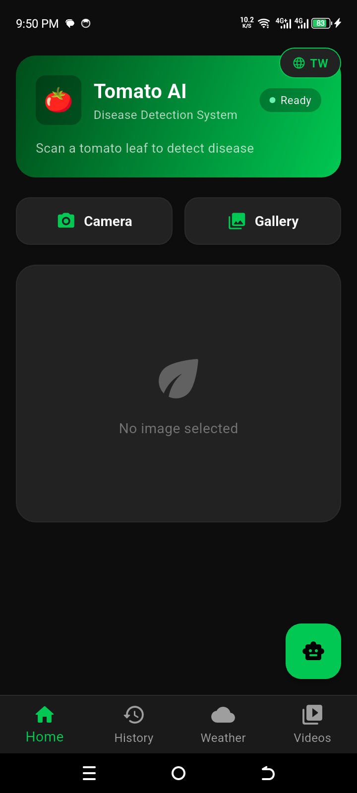
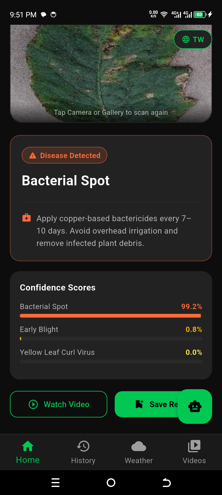
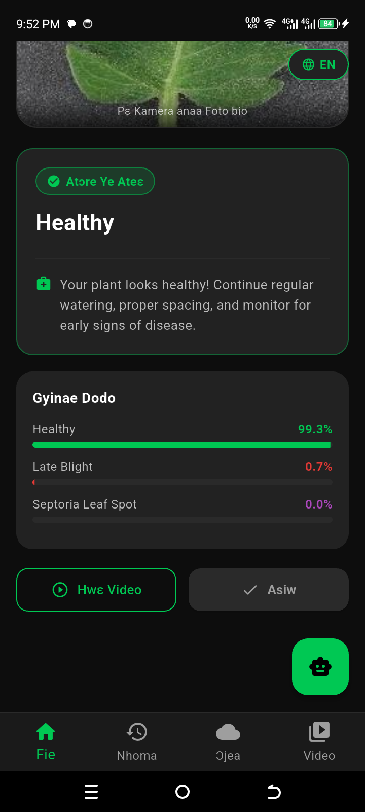
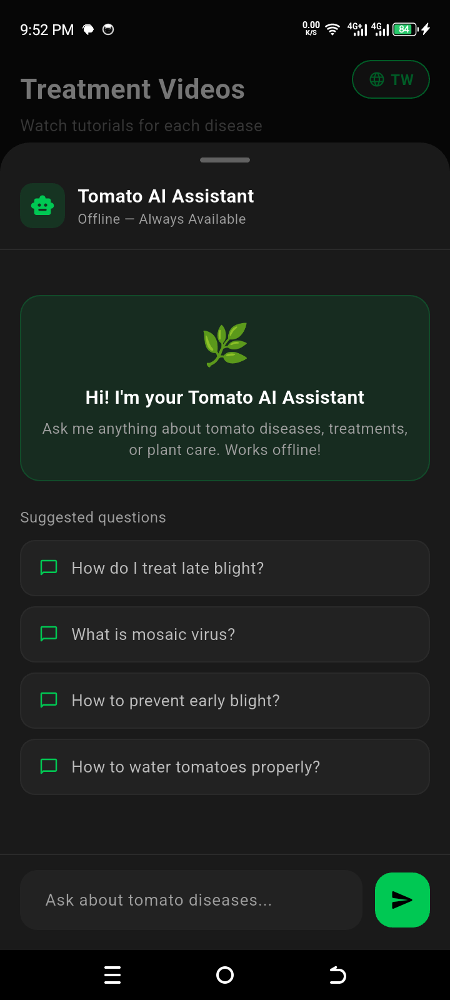
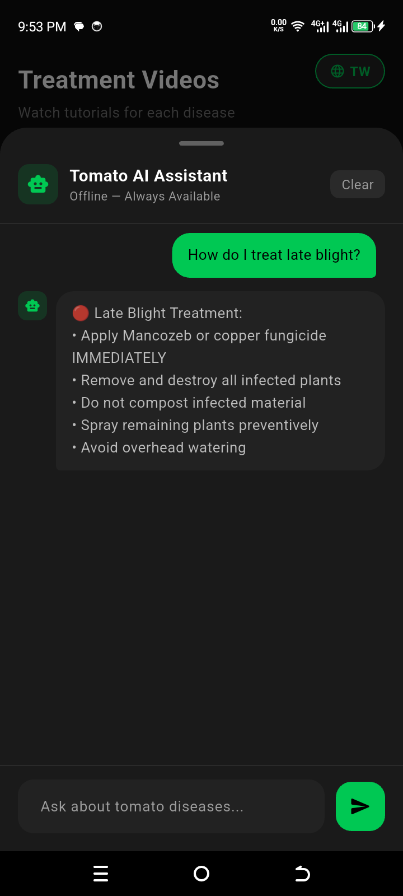
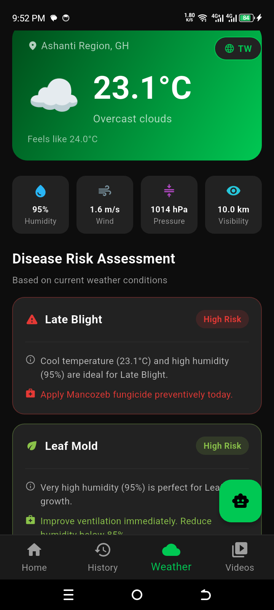
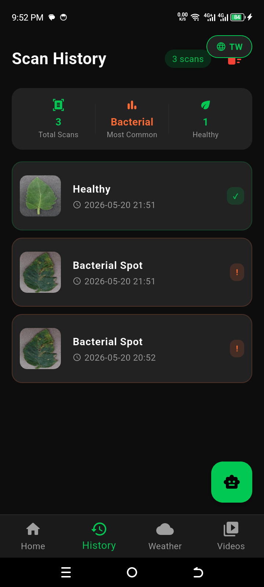
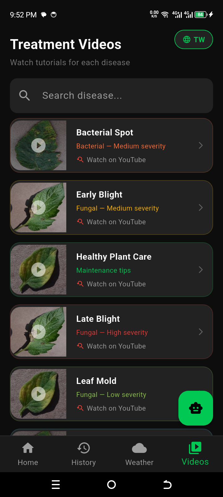

# 🍅 Tomato AI Leaf Disease Detection System

An intelligent Flutter-based mobile application that detects tomato plant diseases using Artificial Intelligence and TensorFlow Lite.

Tomato AI helps farmers, students, gardeners, and agricultural researchers identify tomato leaf diseases quickly using on-device machine learning — even without internet access.

---

## 📱 Features

### 🔍 AI Disease Detection

- Detects tomato diseases from leaf images
- Uses TensorFlow Lite for offline inference
- Works with:
  - Camera capture
  - Gallery images
- Displays confidence scores
- Provides treatment recommendations

### Supported Diseases

- Bacterial Spot
- Early Blight
- Healthy
- Late Blight
- Leaf Mold
- Mosaic Virus
- Septoria Leaf Spot
- Target Spot
- Yellow Leaf Curl Virus

---

## 🗣️ Text-to-Speech

- Reads diagnosis results aloud
- Helps users with low literacy
- Uses Flutter TTS

---

## 🌦️ Weather Risk Assessment

- Uses weather conditions to estimate disease risk
- Retrieves:
  - Temperature
  - Humidity
  - Weather conditions
- Powered by OpenWeatherMap API

---

## 📜 Scan History

- Stores previous scans locally
- View scan date and disease detected
- Delete individual scans
- Clear all history

---

## 🎥 Treatment Videos

- Provides YouTube treatment resources
- Helps users learn disease management visually

---

## 🤖 Offline Chatbot

- Built-in rule-based agricultural assistant
- Answers tomato farming questions
- Provides:
  - Prevention tips
  - Treatment advice
  - General tomato care guidance

---

## 🌍 Multi-language Support

Supports:

- English
- Twi

Language preference is saved automatically.

---

## 🛠️ Built With

## Frontend

- Flutter
- Dart

## Machine Learning

- TensorFlow Lite
- Custom trained tomato disease model

## Packages Used

```yaml
image_picker
tflite_flutter
flutter_tts
shared_preferences
youtube_player_flutter
url_launcher
path_provider
geolocator
http
image
````

---

## 📂 Project Structure

```bash
tomato_app/
│
├── mobile_app/
│   ├── lib/
│   │   ├── models/
│   │   ├── screens/
│   │   ├── translations/
│   │   └── main.dart
│   │
│   ├── assets/
│   │   └── tomato_model.tflite
│   │
│   ├── android/
│   ├── ios/
│   ├── pubspec.yaml
│   └── README.md
│
├── model_training/
│   ├── datasets/
│   ├── training_notebooks/
│   └── trained_models/
│
└── README.md
```

---

## 🚀 Installation

### 1️⃣ Clone Repository

```bash
git clone https://github.com/Boat-ui/Tomato-AI.git
cd Tomato-AI
```

---

### 2️⃣ Open Flutter App

```bash
cd mobile_app
```

---

### 3️⃣ Install Dependencies

```bash
flutter pub get
```

---

### 4️⃣ Run the App

```bash
flutter run
```

---

## 🧠 Machine Learning Model

The app uses a TensorFlow Lite model trained on tomato leaf disease datasets.

### Model Type

- Image Classification

### Framework

- TensorFlow / TensorFlow Lite

### Deployment

- On-device inference
- Offline support

---

## 🌐 API Configuration

The weather feature requires an OpenWeatherMap API key.

Inside:

```bash
weather_page.dart
```

Replace:

```dart
YOUR_API_KEY
```

with your actual API key.

---

## 📸 Screens Included

- Home Screen
- Disease Detection Screen
- Scan History
- Weather Risk Dashboard
- Treatment Videos
- AI Chatbot

## 📸 App Screenshots

## 🏠 Home Page



## 🍅 Disease Detection





## 🤖 Chatbot





## 🌦️ Weather System



## 📜 Scan History Preview



## 🎥 Treatment Videos Preview



---

## 🎯 Future Improvements

- Real-time camera scanning
- Cloud synchronization
- More crop disease support
- Firebase integration
- User authentication
- Farmer community features

---

## 👨‍💻 Developer

Developed by Boateng Enock

BSc. Information Technology
University of Energy and Natural Resources (UENR)

---

## 📄 License

This project is for educational and research purposes.

---

## ⭐ Support

If you like this project:

- Star the repository
- Share the project
- Contribute improvements
